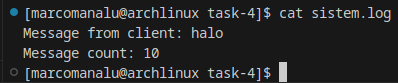

[](https://classroom.github.com/a/9LcL5VTQ)
|    NRP     |      Name      |
| :--------: | :------------: |
| 5025221000 | Student 1 Name |
| 5025221000 | Student 2 Name |
| 5025221000 | Student 3 Name |

# Praktikum Modul 2 _(Module 2 Lab Work)_

</div>

### Daftar Soal _(Task List)_

- [Task 1 - Trabowo & Peddy Movie Night](/task-1/)

- [Task 2 - Organize and Analyze Anthony's Favorite Films](/task-2/)

- [Task 3 - Cella’s Manhwa](/task-3/)

- [Task 4 - Pipip's Load Balancer](/task-4/)

### Laporan Resmi Praktikum Modul 2 _(Module 2 Lab Work Report)_

## Task 2 (Marco)
### **a. One Click and Done!**
Pernahkah kamu merasa malas untuk mengelola file ZIP yang penuh dengan data film? Anthony merasa hal yang sama, jadi dia ingin semuanya serba instan dengan hanya satu perintah. Dengan satu perintah saja, Anthony bisa:

- Mendownload file ZIP yang berisi data film-film Netflix favoritnya.
- Mengekstrak file ZIP tersebut ke dalam folder yang sudah terorganisir.
- Menghapus file ZIP yang sudah tidak diperlukan lagi, supaya tidak memenuhi penyimpanan.

Buatlah skrip yang akan mengotomatiskan proses ini sehingga Anthony hanya perlu menjalankan satu perintah untuk mengunduh, mengekstrak, dan menghapus file ZIP.

1. Saya membuka terminal dan membuat file automasi download_extract.sh

```
touch download_extract.sh
```

dan mengisi program pada file yang sudah saya buat

```
nano download_extract.sh
```

Source Code
``` bash
#!/bin/bash

# === Konfigurasi ===
FILE_ID="12GWsZbSH858h2HExP3x4DfWZB1jLdV-J"
FILE_NAME="netflixData.zip"
DEST_FOLDER="netflixData"

# === Step 1: Download ZIP dari Google Drive ===
echo "[INFO] Mengunduh file ZIP dari Google Drive..."

wget --no-check-certificate "https://drive.google.com/uc?export=download&id=${FILE_ID}" -O "$FILE_NAME"

if [[ $? -ne 0 ]]; then
  echo "[ERROR] Gagal mengunduh file."
  exit 1
fi

echo "[INFO] Unduhan selesai: $FILE_NAME"

# === Step 2: Ekstrak ke folder tujuan ===
echo "[INFO] Mengekstrak file ZIP..."

mkdir -p "$DEST_FOLDER"
unzip -q "$FILE_NAME" -d "$DEST_FOLDER"

if [[ $? -ne 0 ]]; then
  echo "[ERROR] Gagal mengekstrak file ZIP."
  exit 1
fi

echo "[INFO] Ekstraksi selesai ke folder '$DEST_FOLDER'"

# === Step 3: Hapus file ZIP ===
rm "$FILE_NAME"
echo "[INFO] File ZIP dihapus."

# === Selesai ===
echo "[DONE] Semua proses selesai."

```

2. Saya menambahkan izin untuk eksekusi file pada terminal dengan 

```
chmod +x download_extract.sh
```

3. Saya menjalankan program dengan perintah pada terminal

```
./download_extract.sh
```

4. Dan program berhasil dijalankan


dan direktori berisi file yang ingin diunduh  


### **b. Sorting Like a Pro**
Koleksi film Anthony semakin banyak dan dia mulai bingung mencari cara yang cepat untuk mengelompokkannya. Nah, Anthony ingin mengelompokkan film-filmnya dengan dua cara yang sangat mudah:

1. Berdasarkan huruf pertama dari judul film.
2. Berdasarkan tahun rilis (release year).

Namun, karena Anthony sudah mempelajari **multiprocessing**, dia ingin mengelompokkan kedua kategori ini secara paralel untuk menghemat waktu.

**Struktur Output:**

- **Berdasarkan Huruf Pertama Judul Film:**

  - Folder: `judul/`
  - Setiap file dinamai dengan huruf abjad atau angka, seperti `A.txt`, `B.txt`, atau `1.txt`.
  - Jika judul film tidak dimulai dengan huruf atau angka, film tersebut disimpan di file `#.txt`.

- **Berdasarkan Tahun Rilis:**
  - Folder: `tahun/`
  - Setiap file dinamai sesuai tahun rilis film, seperti `1999.txt`, `2021.txt`, dst.

Format penulisan dalam setiap file :

```
Judul Film - Tahun Rilis - Sutradara
```

Setiap proses yang berjalan akan mencatat aktivitasnya ke dalam satu file bernama **`log.txt`** dengan format:

```
[jam:menit:detik] Proses mengelompokkan berdasarkan [Abjad/Tahun]: sedang mengelompokkan untuk film [judul_film]
```

**Contoh Log:**

```
[14:23:45] Proses mengelompokkan berdasarkan Abjad: sedang mengelompokkan untuk film Avengers: Infinity War
[14:23:46] Proses mengelompokkan berdasarkan Tahun: sedang mengelompokkan untuk film Kung Fu Panda
```
1. Saya membuka terminal dan membuat file automasi sort_movies.sh

```
touch sort_movies.sh
```

dan mengisi program pada file yang sudah saya buat

```
nano sort_movies.sh
```

Source Code
``` bash
#!/bin/bash

MOVIES_DIR="netflixData"
MOVIES_FILE=$(find "$MOVIES_DIR" -type f -name "*.csv" | head -n 1)

mkdir -p judul tahun
> log.txt

# Judul
sort_by_title() {
  tail -n +2 "$MOVIES_FILE" | while IFS=',' read -r title director country year; do
    # Validasi tahun
    if [[ ! "$year" =~ ^[0-9]{4}$ ]]; then
      continue
    fi

    # Bersihkan kutipan dan spasi
    title_clean=$(echo "$title" | sed 's/^"//;s/"$//')
    director_clean=$(echo "$director" | sed 's/^"//;s/"$//')

    first="${title_clean:0:1}"
    if [[ "$first" =~ [A-Za-z0-9] ]]; then
      out_file="judul/${first^^}.txt"
    else
      out_file="judul/#.txt"
    fi

    echo "$title_clean - $year - $director_clean" >> "$out_file"
    echo "[$(date +%T)] Proses mengelompokkan berdasarkan Abjad: sedang mengelompokkan untuk film $title_clean" >> log.txt
  done
}

# Tahun
sort_by_year() {
  tail -n +2 "$MOVIES_FILE" | while IFS=',' read -r title director country year; do
    if [[ ! "$year" =~ ^[0-9]{4}$ ]]; then
      continue
    fi

    title_clean=$(echo "$title" | sed 's/^"//;s/"$//')
    director_clean=$(echo "$director" | sed 's/^"//;s/"$//')

    out_file="tahun/${year}.txt"
    echo "$title_clean - $year - $director_clean" >> "$out_file"
    echo "[$(date +%T)] Proses mengelompokkan berdasarkan Tahun: sedang mengelompokkan untuk film $title_clean" >> log.txt
  done
}

sort_by_title &
sort_by_year &
wait

echo "[DONE] Pengelompokan berhasil dan log.txt sudah terisi."

```

2. Saya menambahkan izin untuk eksekusi file pada terminal dengan 

```
chmod +x sort_movies.sh
```

3. Saya menjalankan program dengan perintah pada terminal

```
./sort_movies.sh
```
4. Dan program berhasil dijalankan


lihat isi file judul untuk memastikan kecocokan dari perintah yang diminta


lihat isi file tahun untuk memastikan kecocokan dari perintah yang diminta


dan lihat file log


### **c. The Ultimate Movie Report**

Sebagai penggemar film yang juga suka menganalisis, Anthony ingin mengetahui statistik lebih mendalam tentang film-film yang dia koleksi. Misalnya, dia ingin tahu berapa banyak film yang dirilis **sebelum tahun 2000** dan **setelah tahun 2000**.

Agar laporan tersebut mudah dibaca, Anthony ingin hasilnya disimpan dalam file **`report_ddmmyyyy.txt`**.

**Format Output dalam Laporan:**

```
i. Negara: <nama_negara>
Film sebelum 2000: <jumlah>
Film setelah 2000: <jumlah>

...
i+n. Negara: <nama_negara>
Film sebelum 2000: <jumlah>
Film setelah 2000: <jumlah>
```

Agar penggunaannya semakin mudah, Anthony ingin bisa menjalankan semua proses di atas melalui sebuah antarmuka terminal interaktif dengan pilihan menu seperti berikut:
1. Download File
2. Mengelompokkan Film
3. Membuat Report

Catatan:
- Dilarang menggunakan `system`
- Harap menggunakan thread dalam pengerjaan soal C

1. Saya membuka terminal dan membuat file automasi Anthony.c

```
touch Anthony.c
```

dan mengisi program pada file yang sudah saya buat

```
nano Anthony.c
```

Source Code

```
// File: Anthony.c

#include <stdio.h>
#include <stdlib.h>
#include <string.h>
#include <time.h>
#include <pthread.h>

#define MAX_LINE      1024
#define MAX_COUNTRY   200

typedef struct {
    char country[128];
    int before_2000;
    int after_2000;
} CountryStats;

typedef struct {
    CountryStats stats[MAX_COUNTRY];
    int count;
    pthread_mutex_t lock;
} ReportData;

// Hilangkan newline/carriage return di ujung string
void trim_newline(char *s) {
    char *p = s + strlen(s) - 1;
    while (p >= s && (*p == '\n' || *p == '\r')) {
        *p-- = '\0';
    }
}

void *thread_process_csv(void *arg) {
    ReportData *rd = (ReportData *)arg;
    FILE *f = fopen("netflixData/netflixData.csv", "r");
    if (!f) {
        perror("Gagal membuka netflixData/netflixData.csv");
        pthread_exit(NULL);
    }

    char line[MAX_LINE];
    int lineno = 0;
    while (fgets(line, sizeof(line), f)) {
        lineno++;
        if (lineno == 1) continue;  // skip header

        trim_newline(line);
        // Tokenize: title,director,country,release year
        char *title    = strtok(line, ",");
        char *director = strtok(NULL, ",");
        char *country  = strtok(NULL, ",");
        char *year_s   = strtok(NULL, ",");

        if (!country || !year_s) continue;
        int year = atoi(year_s);
        if (year <= 0) continue;

        // update stats
        pthread_mutex_lock(&rd->lock);
        int found = 0;
        for (int i = 0; i < rd->count; i++) {
            if (strcmp(rd->stats[i].country, country) == 0) {
                if (year < 2000) rd->stats[i].before_2000++;
                else             rd->stats[i].after_2000++;
                found = 1;
                break;
            }
        }
        if (!found && rd->count < MAX_COUNTRY) {
            // tambah negara baru
            CountryStats *cs = &rd->stats[rd->count];
            strncpy(cs->country, country, sizeof(cs->country)-1);
            cs->country[sizeof(cs->country)-1] = '\0';
            cs->before_2000 = (year < 2000);
            cs->after_2000  = (year >= 2000);
            rd->count++;
        }
        pthread_mutex_unlock(&rd->lock);
    }

    fclose(f);
    pthread_exit(NULL);
}

int main(void) {
    ReportData rd;
    rd.count = 0;
    pthread_mutex_init(&rd.lock, NULL);

    // jalankan single thread untuk memproses CSV
    pthread_t tid;
    if (pthread_create(&tid, NULL, thread_process_csv, &rd)) {
        fprintf(stderr, "Error membuat thread\n");
        return 1;
    }
    pthread_join(tid, NULL);

    // buat nama file report_DDMMYYYY.txt
    time_t now = time(NULL);
    struct tm *t = localtime(&now);
    char fname[64];
    strftime(fname, sizeof(fname), "report_%d%m%Y.txt", t);

    FILE *out = fopen(fname, "w");
    if (!out) {
        perror("Gagal membuat file laporan");
        return 1;
    }

    for (int i = 0; i < rd.count; i++) {
        fprintf(out,
            "%d. Negara: %s\n"
            "   Film sebelum 2000: %d\n"
            "   Film setelah 2000: %d\n\n",
            i+1,
            rd.stats[i].country,
            rd.stats[i].before_2000,
            rd.stats[i].after_2000
        );
    }
    fclose(out);
    pthread_mutex_destroy(&rd.lock);

    printf("✅ Report generated: %s\n", fname);
    return 0;
}

```
2. Saya kompile program C tersebut dengan

```
gcc Anthony.c -o Anthony
```


3. Saya menjalankan program dengan perintah pada terminal

```
./Anthony
```
4. Dan program berhasil dijalankan


melihat isi file untuk memeriksa keberhasilan program


5. Untuk mempermudah menjalankan keseluruhan, saya membuat interface terminal interaktif.

Saya membuka terminal dan membuat file menu.sh

```
touch menu.sh
```

dan mengisi program pada file yang sudah saya buat

```
nano menu.sh
```

Source Code

```
#!/bin/bash

# Fungsi untuk menampilkan menu
show_menu() {
    clear
    echo "================================="
    echo " Menu Utama - Anthony's Program "
    echo "================================="
    echo "1. Download File"
    echo "2. Mengelompokkan Film"
    echo "3. Membuat Report"
    echo "4. Keluar"
    echo "================================="
    echo -n "Masukkan pilihan Anda [1-4]: "
}

# Fungsi untuk menjalankan script dan menangani error
run_script() {
    local script=$1
    echo "Menjalankan $script..."
    
    if [ -f "$script" ]; then
        if [ -x "$script" ]; then
            ./"$script"
            local status=$?
            if [ $status -ne 0 ]; then
                echo "Error: $script gagal dijalankan dengan status $status"
                read -p "Tekan Enter untuk melanjutkan..."
            fi
        else
            echo "Error: $script tidak memiliki izin eksekusi"
            read -p "Tekan Enter untuk melanjutkan..."
        fi
    else
        echo "Error: File $script tidak ditemukan"
        read -p "Tekan Enter untuk melanjutkan..."
    fi
}

# Main program
while true; do
    show_menu
    read choice
    
    case $choice in
        1)
            run_script "download_extract.sh"
            ;;
        2)
            run_script "sort_movies.sh"
            ;;
        3)
            # Kompilasi Anthony.c jika diperlukan
            if [ -f "Anthony.c" ]; then
                echo "Mengkompilasi Anthony.c..."
                gcc Anthony.c -o Anthony
                if [ $? -eq 0 ]; then
                    run_script "Anthony"
                else
                    echo "Error: Gagal mengkompilasi Anthony.c"
                    read -p "Tekan Enter untuk melanjutkan..."
                fi
            else
                echo "Error: File Anthony.c tidak ditemukan"
                read -p "Tekan Enter untuk melanjutkan..."
            fi
            ;;
        4)
            echo "Terima kasih, sampai jumpa!"
            exit 0
            ;;
        *)
            echo "Pilihan tidak valid. Silakan pilih 1-4."
            read -p "Tekan Enter untuk melanjutkan..."
            ;;
    esac
done
```

lalu saya jalankan dengan perintah pada terminal

```
./menu.sh
```


---

## Task 4 (Marco)
### **a. Client Mengirimkan Pesan ke Load Balancer**

Pipip ingin agar proses `client.c` dapat mengirimkan pesan ke `loadbalancer.c` menggunakan IPC dengan metode **shared memory**. Proses pengiriman pesan dilakukan dengan format input dari pengguna sebagai berikut:

```
Halo A;10
```

**Penjelasan:**

- `"Halo A"` adalah isi pesan yang akan dikirim.
- `10` adalah jumlah pesan yang ingin dikirim, dalam hal ini sebanyak 10 kali pesan yang sama.

Selain itu, setiap kali pesan dikirim, proses `client.c` harus menuliskan aktivitasnya ke dalam **`sistem.log`** dengan format:

```
Message from client: <isi pesan>
Message count: <jumlah pesan>
```

Semua pesan yang dikirimkan dari client akan diteruskan ke `loadbalancer.c` untuk diproses lebih lanjut.

1. Saya membuka terminal dan membuat file client.c

```
touch client.c
```

dan mengisi program pada file yang sudah saya buat

```
nano client.c
```

Source Code
```
#include <stdio.h>
#include <stdlib.h>
#include <string.h>
#include <sys/ipc.h>
#include <sys/shm.h>

#define SHM_KEY 1234
#define MAX_MSG_LEN 256

typedef struct {
    char message[MAX_MSG_LEN];
    int count;
} SharedData;

int main() {
    char input[300];
    printf("Masukkan pesan dan jumlah (format: Pesan;Jumlah): ");
    fgets(input, sizeof(input), stdin);
    input[strcspn(input, "\n")] = '\0';  // hapus newline

    // Parsing input
    char *token = strtok(input, ";");
    if (token == NULL) {
        fprintf(stderr, "Format salah. Harus Pesan;Jumlah\n");
        return 1;
    }

    char pesan[MAX_MSG_LEN];
    strncpy(pesan, token, MAX_MSG_LEN);

    token = strtok(NULL, ";");
    if (token == NULL) {
        fprintf(stderr, "Jumlah tidak ditemukan.\n");
        return 1;
    }
    int jumlah = atoi(token);

    // Akses atau buat shared memory
    int shmid = shmget(SHM_KEY, sizeof(SharedData), IPC_CREAT | 0666);
    if (shmid < 0) {
        perror("shmget error");
        return 1;
    }

    SharedData *data = (SharedData *) shmat(shmid, NULL, 0);
    if (data == (void *) -1) {
        perror("shmat error");
        return 1;
    }

    // Tulis ke shared memory
    strncpy(data->message, pesan, MAX_MSG_LEN);
    data->count = jumlah;

    // Tulis ke log
    FILE *log = fopen("sistem.log", "a");
    if (log != NULL) {
        fprintf(log, "Message from client: %s\n", pesan);
        fprintf(log, "Message count: %d\n", jumlah);
        fclose(log);
    } else {
        perror("Gagal membuka sistem.log");
    }

    // Detach shared memory
    shmdt(data);

    printf("Pesan dikirim ke load balancer melalui shared memory.\n");
    return 0;
}

```

2. Saya kompile program C tersebut dengan

```
gcc client.c -o client
```


3. Saya menjalankan program dengan perintah pada terminal

```
./client
```
4. Dan program berhasil dijalankan


lihat isi sistem.log



### **b. Load Balancer Mendistribusikan Pesan ke Worker Secara Round-Robin**

Setelah menerima pesan dari client, tugas `loadbalancer.c` adalah mendistribusikan pesan-pesan tersebut ke beberapa **worker** menggunakan metode **round-robin**. Sebelum mendistribusikan pesan, `loadbalancer.c` terlebih dahulu mencatat informasi ke dalam **`sistem.log`** dengan format:

```
Received at lb: <isi pesan> (#message <indeks pesan>)
```

Contoh jika ada 10 pesan yang dikirimkan, maka output log yang dihasilkan adalah:

```
Received at lb: Halo A (#message 1)
Received at lb: Halo A (#message 2)
...
Received at lb: Halo A (#message 10)
```

Setelah itu, `loadbalancer.c` akan meneruskan pesan-pesan tersebut ke **n worker** secara bergiliran (round-robin), menggunakan **IPC message queue**. Berikut adalah contoh distribusi jika jumlah worker adalah 3:

- Pesan 1 → worker1
- Pesan 2 → worker2
- Pesan 3 → worker3
- Pesan 4 → worker1 (diulang dari awal)

Dan seterusnya.

Proses `worker.c` bertugas untuk mengeksekusi pesan yang diterima dan mencatat log ke dalam file yang sama, yakni **`sistem.log`**.

1. Saya membuka terminal dan membuat file loadbalancer.c

```
touch loadbalancer.c
```

dan mengisi program pada file yang sudah saya buat

```
nano loadbalancer.c
```

Source Code
```
#include <stdio.h>
#include <stdlib.h>
#include <string.h>
#include <sys/ipc.h>
#include <sys/shm.h>
#include <sys/msg.h>
#include <unistd.h>

#define SHM_KEY 1234
#define MAX_MSG_LEN 256
#define MAX_WORKERS 10

typedef struct {
    char message[MAX_MSG_LEN];
    int count;
} SharedData;

struct msg_buffer {
    long msg_type;
    char msg_text[MAX_MSG_LEN];
};

int main() {
    int num_workers;
    printf("Masukkan jumlah worker: ");
    scanf("%d", &num_workers);

    if (num_workers > MAX_WORKERS || num_workers <= 0) {
        printf("Jumlah worker tidak valid (maks %d)\n", MAX_WORKERS);
        return 1;
    }

    // Ambil shared memory
    int shmid = shmget(SHM_KEY, sizeof(SharedData), 0666);
    if (shmid < 0) {
        perror("shmget error");
        return 1;
    }

    SharedData *data = (SharedData *) shmat(shmid, NULL, 0);
    if (data == (void *) -1) {
        perror("shmat error");
        return 1;
    }

    // Setup message queue untuk tiap worker
    int msgids[MAX_WORKERS];
    for (int i = 0; i < num_workers; i++) {
        key_t key = ftok(".", 'A' + i);  // unik untuk setiap worker
        msgids[i] = msgget(key, IPC_CREAT | 0666);
        if (msgids[i] < 0) {
            perror("msgget error");
            return 1;
        }
    }

    FILE *log = fopen("sistem.log", "a");
    if (!log) {
        perror("Gagal membuka sistem.log");
        return 1;
    }

    for (int i = 0; i < data->count; i++) {
        // Tulis log
        fprintf(log, "Received at lb: %s (#message %d)\n", data->message, i + 1);

        // Kirim pesan ke worker round-robin
        int worker_id = i % num_workers;
        struct msg_buffer msg;
        msg.msg_type = 1;
        strncpy(msg.msg_text, data->message, MAX_MSG_LEN);

        if (msgsnd(msgids[worker_id], &msg, sizeof(msg.msg_text), 0) < 0) {
            perror("msgsnd error");
        }
    }

    fclose(log);
    shmdt(data); // detach shared memory

    printf("Pesan telah didistribusikan ke worker menggunakan round-robin.\n");
    return 0;
}

```

2. Saya kompile program C tersebut dengan

```
gcc loadbalancer.c -o loadbalancer
```


3. Saya menjalankan program dengan perintah pada terminal

```
./loadbalancer
```
4. Dan program berhasil dijalankan


### **c. Worker Mencatat Pesan yang Diterima**

Setiap worker yang menerima pesan dari `loadbalancer.c` harus mencatat pesan yang diterima ke dalam **`sistem.log`** dengan format log sebagai berikut:

```
WorkerX: message received
```
1. Saya membuka terminal dan membuat file worker.c

```
touch worker.c
```

dan mengisi program pada file yang sudah saya buat

```
nano worker.c
```

Source Code
```
#include <stdio.h>
#include <stdlib.h>
#include <string.h>
#include <sys/ipc.h>
#include <sys/msg.h>
#include <unistd.h>

#define MAX_MSG_LEN 256

struct msg_buffer {
    long msg_type;
    char msg_text[MAX_MSG_LEN];
};

int main(int argc, char *argv[]) {
    if (argc != 3) {
        fprintf(stderr, "Usage: %s <worker_id> <jumlah_pesan>\n", argv[0]);
        return 1;
    }

    int worker_id = atoi(argv[1]);        // misalnya: 0, 1, 2...
    int jumlah_pesan = atoi(argv[2]);     // jumlah pesan yang akan diterima

    key_t key = ftok(".", 'A' + worker_id);
    int msgid = msgget(key, 0666);
    if (msgid < 0) {
        perror("msgget error");
        return 1;
    }

    FILE *log = fopen("sistem.log", "a");
    if (!log) {
        perror("Gagal membuka sistem.log");
        return 1;
    }

    int received_count = 0;
    struct msg_buffer msg;
    while (received_count < jumlah_pesan) {
        if (msgrcv(msgid, &msg, sizeof(msg.msg_text), 0, 0) < 0) {
            perror("msgrcv error");
            continue;
        }

        fprintf(log, "Worker%d: message received\n", worker_id + 1);
        received_count++;
    }

    // Tulis total pesan setelah selesai
    fprintf(log, "Worker %d: %d messages\n", worker_id + 1, received_count);
    fclose(log);

    printf("Worker %d selesai menerima %d pesan.\n", worker_id + 1, received_count);
    return 0;
}

```

2. Saya kompile program C tersebut dengan

```
gcc worker.c -o worker
```


3. Saya menjalankan program dengan perintah pada terminal

```
./worker 0 4
// worker pertama menerima 4 pesan
./worker 1 3
// worker kedua menerima 3 pesan
./worker 2 3
// worker ketiga menerima 3 pesan
```
4. Dan program berhasil dijalankan


### **d. Catat Total Pesan yang Diterima Setiap Worker di Akhir Eksekusi**

Setelah proses selesai (semua pesan sudah diproses), setiap worker akan mencatat jumlah total pesan yang mereka terima ke bagian akhir file **`sistem.log`**.

```
Worker 1: 3 messages
Worker 2: 4 messages
Worker 3: 3 messages
```

**Penjelasan:**
3 + 4 + 3 = 10, sesuai dengan jumlah pesan yang dikirim pada soal a


